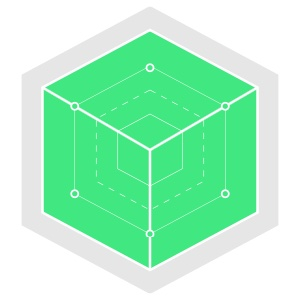

# `ltc`: The Lattice CLI


- Website: [http://lattice.cf](http://lattice.cf)
- Mailing List: [Google Groups](https://groups.google.com/a/cloudfoundry.org/forum/#!forum/lattice)

`ltc` provides an easy-to-use command line interface for [Lattice](https://github.com/pivotal-cf-experimental/lattice)

With `ltc` you can:

- `target` a Lattice deployment
- `create`, `scale` and `remove` Dockerimage-based applications
- tail `logs` for your running applications
- `list` all running applications and `visualize` their distributions across the Lattice cluster
- fetch detail `status` information for a running application

##Setup:

Download the appropriate binary for your architecture.  These link to the *latest* version of `ltc`.  For a specific version visit the [releases](https://github.com/cloudfoundry-incubator/lattice/releases) page.

Platform | Architecture | Link
---------|--------------|--------
MacOS | amd64 | [https://lattice.s3.amazonaws.com/releases/latest/darwin-amd64/ltc](https://lattice.s3.amazonaws.com/releases/latest/darwin-amd64/ltc)
Linux | amd64 | [https://lattice.s3.amazonaws.com/releases/latest/linux-amd64/ltc](https://lattice.s3.amazonaws.com/releases/latest/linux-amd64/ltc)

Here's a simple installation script.  It assumes `$HOME/bin` is on your $PATH

**Mac**:
```bash
  mkdir -p $HOME/bin
  wget https://lattice.s3.amazonaws.com/releases/latest/darwin-amd64/ltc -O $HOME/bin/ltc
  chmod +x $HOME/bin/ltc
```

**Linux**:
```bash
  mkdir -p $HOME/bin
  wget https://lattice.s3.amazonaws.com/releases/latest/linux-amd64/ltc -O $HOME/bin/ltc
  chmod +x $HOME/bin/ltc
```

#### Installing From Source

You must have [Go](https://golang.org) 1.4+ installed and set up correctly.  `ltc` uses [Godeps](https://github.com/tools/godep) to vendor its dependencies.

```
go get -d github.com/cloudfoundry-incubator/lattice/ltc
GOPATH=$GOPATH/src/github.com/cloudfoundry-incubator/lattice/ltc/Godeps/_workspace:$GOPATH go install github.com/cloudfoundry-incubator/lattice/ltc
```

### Example Usage:

    ltc target 192.168.11.11.xip.io
    ltc create lattice-app cloudfoundry/lattice-app
    ltc logs lattice-app

To view the app in a browser visit http://lattice-app.192.168.11.11.xip.io/

To scale up the app:

    ltc scale lattice-app 5

Refresh the browser to see the requests routing to different Docker containers running lattice-app.
